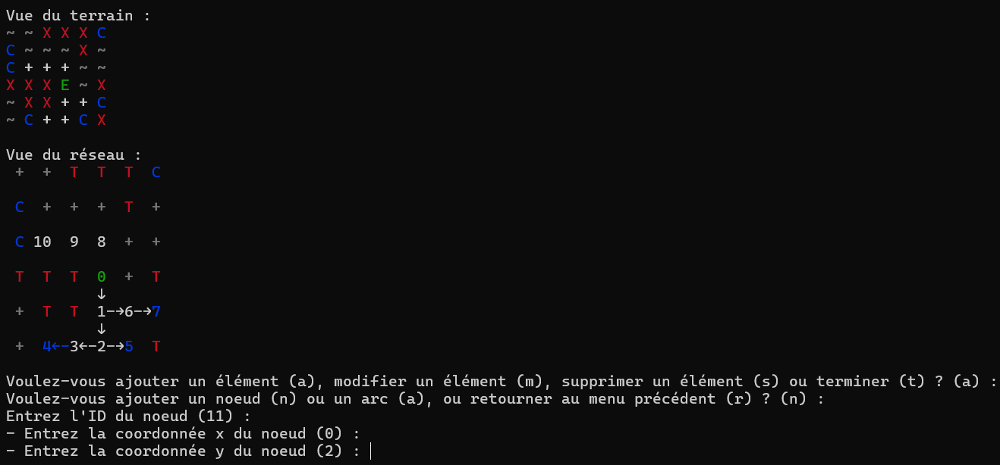

# PowerGrid : Gestion de projet informatique (M1 EEEA - ISTIC)

## Informations
Ce projet a été réalisé au cours du parcours M1-EEEA dans l'UE Développement logiciel - Gestion de projets informatique. Ce projet a pour but d'explorer les différentes approches autour de la création d'un projet, principalement sur l'appropriation d'un projet existant et incomplet (*forkage*), programmer et réaliser différents tests afin de réaliser un programme pouvant être utilisé.

## Présentation du projet *PowerGrid*
***PowerGrid*** est un outil permettant l'optimisation d'un réseau (une distribution électrique, par exemple). Le but du projet est d'adapter ce réseau selon le terrain pour pouvoir alimenter tous les clients qui y sont renseignés.
Le réseau est composé de *noeuds* et d'*arcs*, où les arcs relient 2 noeuds voisins (horizontalement ou verticalement). Le terrain est composé de 4 éléments, dites cases : *vide*, *entrée* (l'entrée du réseau), *client* (les différents clients à alimenter) et *obstacle* (augmente les coûts du réseau si un chemin passe dans un obstacle).

## Architecture du projet
Le projet a été réalisé sous Python, et est structuré autour de plusieurs classes principales. Chaque classe a un rôle spécifique dans la gestion et l'optimisation du réseau de distribution électrique.

### Classe `Terrain`
Cette classe représente la topologie du terrain, incluant les clients, l'entrée électrique et les obstacles. Elle permet de charger les informations depuis un fichier et de manipuler les données du terrain.

### Classe `Reseau`
Cette classe gère la configuration du réseau de distribution électrique. Elle contient des méthodes pour ajouter des noeuds et des arcs, définir l'entrée électrique, valider la configuration du réseau et calculer le coût total du réseau.

### Classe `StrategieReseau`
Il s'agit d'une classe abstraite définissant l'interface pour les stratégies de configuration du réseau. Les classes dérivées, comme `StrategieReseauAutomatique` et `StrategieReseauManuelle`, implémentent des méthodes spécifiques pour configurer le réseau automatiquement ou manuellement.

### Tests unitaires
Des tests unitaires ont été implémentés pour vérifier le bon fonctionnement des différentes méthodes et classes du projet. Ils sont essentiels pour garantir la fiabilité et la robustesse du code.

### Intégration continue
Le projet utilise Jenkins pour l'intégration continue, permettant d'automatiser les tests et de générer des rapports sur les réussites et les échecs à chaque nouvelle modification du code.
Cette architecture modulaire permet une gestion claire et efficace du projet, facilitant les ajouts et modifications futures.

## Utilisation de *PowerGrid*
Le programme se lance dans une `invite de commande` (appelée aussi `terminal de commande`). Vous aurez alors le choix entre 4 méthodes :

### Créer un réseau manuellement
Vous pouvez créer un réseau par vous-même en indiquant les différents noeuds à placer sur un terrain, et les arcs reliant ces noeuds. Vous pourrez aussi vous aider de l'auto-complétion du programme pour créer votre réseau.

  

### Créer un réseau automatiquement
Vous ne voulez pas réaliser vous-même le réseau, ou vous voudriez connaître quel est le réseau le plus optimal et le moins coûteux ? Un algortihme s'occupera de le faire pour vous

### Afficher le terrain
Affichez le terrain et le réseau qui a été réalisé précédemment. Vous pourrez aussi savoir le coût total du réseau ainsi que la validité.

### Charger un nouveau terrain
Vous pouvez changer le terrain présent dans le dossier `terrains` au format *texte*.